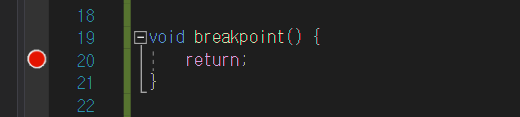
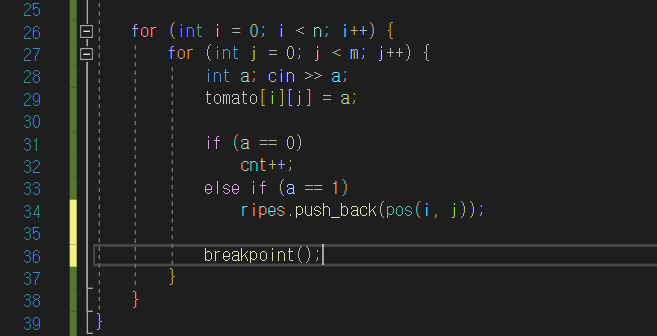

> Breakpoint(중단점)

개발 도중 디버깅을 위해 의도적으로 프로그램을 멈추는 것. IDE에서 중단점을 찍은 줄을 실행하기 직전에 멈춘다.

> 구현 방식

개발 도중 멈추고자 하는 지점을 찍기 위해서 불필요한 line을 작성할 때가 있음. 이를 위해 breakpoint라는 함수를 만들고 이 함수 내부에만 breakpoint를 찍고 실제로 필요할 때 이 함수를 호출해 사용하도록 함.

> 코드
```cpp
void breakpint() {
    return; // breakpoint 찍을 위치
}
```
<br>

* * *
</img>

</img>
